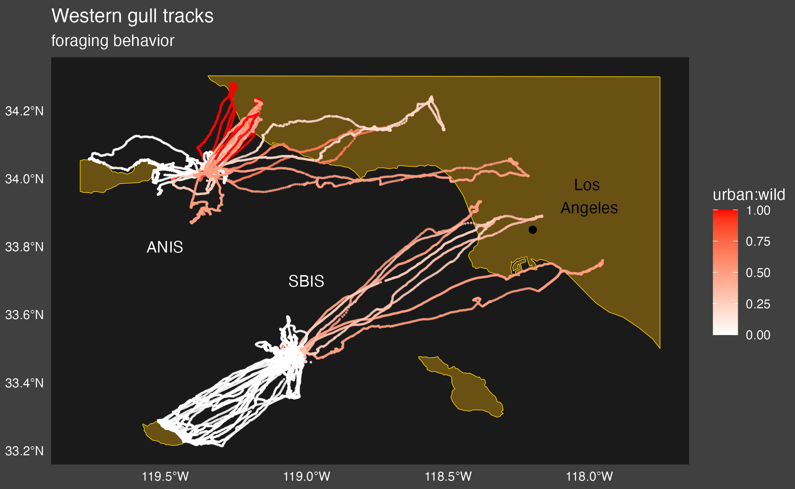

# Leaving more than footprints: Anthropogenic nutrient subsidies to a protected area

GPS tracks of Western Gulls in the Channel Islands National Park, California

## Project Information

### Brief Summary

### Abstract

Mobile animals that traverse ecosystem boundaries can fundamentally reshape environments by providing critical nutrient and energy inputs to the ecosystems they inhabit. In particular, aggregations of seabirds often transform coastal and island ecosystems through large amounts of nutrient-rich guano deposition. Anthropogenically driven losses of these subsidies can occur through changes in abundance of mobile species, including seabirds, and have been shown to drive whole-scale ecosystem state change on islands. However, even though many species that forage on anthropogenic food sources are highly mobile and may thus play important roles in moving nutrients from urban systems to otherwise conserved ecosystems, the impacts of anthropogenic supplements on spatial subsidies have been largely ignored. Here we examine the effects of large nesting colonies of Western Gulls (Larus occidentalis), a generalist carnivore known to forage on human refuse, on the Channel Islands of California. Specifically, we explore how their foraging on human subsidies may change nutrient deposition patterns at their relatively remote and protected breeding islands. We equipped gulls with GPS loggers to assess the frequency of urban foraging, and we partnered this tracking data with bird density data to estimate the rate of wild and urban-derived guano deposition on two different islands. Consistent with research on other gull species, we found high (up to 40%) but island-specific rates of urban foraging, resulting between 66 and 93kg/ha of guano in these two sites during the breeding season, a level greater than half the amount of fertilizer applied annually in typical commercial agricultural settings and likely the primary source of nitrogen and phosphorus inputs to this system. Specifically, we estimate that 27kg/ha/year of nutrient-rich guano is shuttled to these otherwise isolated islands from anthropogenic sources. This research highlights the large shadow (i.e., footprint) that human activity can cast on even remote ecosystems by driving significant nutrient enrichment through impacts on animal behavior and connectivity.

### Authors

**Ana Sofia Guerra, PhD** A. Bui, M. Klope, D. A. Orr, S. A. Shaffer, H. S. Young

### Institution

This work was conducted while funded by the University of California Santa Barbara

### Citation

Guerra, AS., et al. *"Leaving more than footprints: Anthropogenic nutrient subsidies to a protected area."* **Ecosphere** 13.12 (2022): e4371.[link](https://esajournals.onlinelibrary.wiley.com/doi/full/10.1002/ecs2.4371)

## This Repo

This repo provides the code for wrangling, summarizing, and visualizing Western Gull tracking data from the Channel Islands.

#### **Island Tracks Figure**

### Repo Structure

-   `1_functions_script.R` loads functions necessary for funning scripts 2 and 3.
-   `2_track_analysis_script.R` analyzes track data and must be run before running the visualization script.\
-   `3_tracks_viz_script` for generating track maps.\
-   `data`: Folder containing all data files. Due to large file size, data are not in the repo but are available upon request. They are contained in this folder and are sourced in code using relative paths.
-   `CHIS2016_TrackData.csv`: track data analyzed by collaborator Scott Schaffer (see methods).
-   `CHIS2016_HabitatType.SN.csv`: track data analyzed by collaborator Scott Schaffer (see methods).
-   `CHIS2016_Metadata_trackanalysis.csv`: for combining different datasets (see methods).
-   `trackfiles` folder within data folder that contains tracks for all the tagged gulls (as csv).
